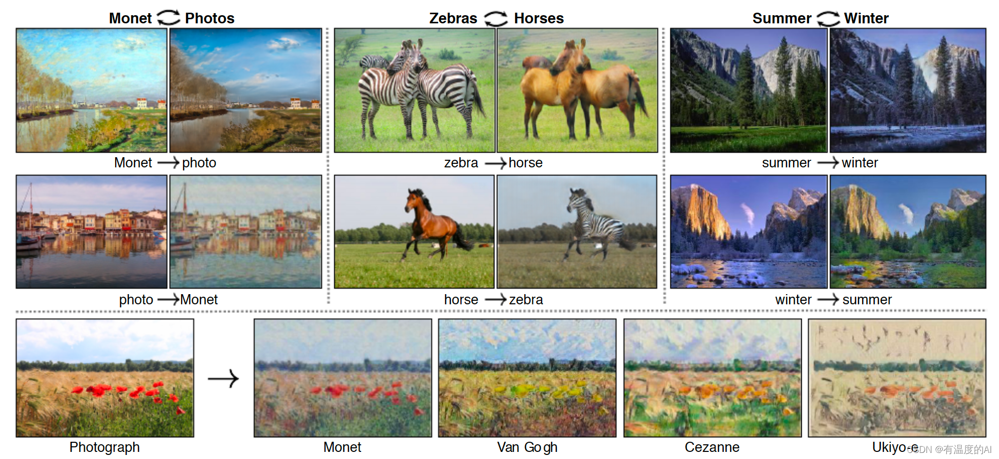
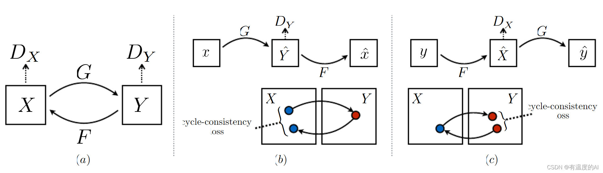

# CycleGAN
Pytorch实现版本

## 模型介绍
论文：Unpaired Image-to-Image Translation using Cycle-Consistent Adversarial Networks

论文地址：https://arxiv.org/abs/1703.10593



CycleGAN(循环生成对抗网络)是一种特殊的GAN，用于解决无监督学习中的图像到图像的翻译问题。训练时不需要成对的配对样本，只需要源域和目标域的图像。训练后网络就能实现对图像源域到目标域的迁移。解决了模型需要成对数据进行训练的困难。

**特点：**

1. **双向训练**：CycleGAN包含两个生成器和两个判别器。一个生成器负责将图像从域A翻译到域B，另一个则相反。对应地，每个域都有一个判别器。
2. **循环一致性损失（Cycle Consistency Loss）**：这是CycleGAN的核心创新。它确保如果一个图像从域A翻译到域B，然后再翻译回域A，最终得到的图像应该与原始图像尽可能相似。这样的损失函数帮助模型学习在没有成对数据的情况下进行有效的翻译。
3. **无需成对数据**：与需要成对数据的传统图像到图像的翻译方法不同，CycleGAN不需要成对的训练样本。这大大增加了其应用范围，因为在许多情况下，获取精确配对的训练数据是不切实际的。

区别于pix2pixGAN：p2p需要成对的数据集

**模型架构图**



**(a)图**展示了cycleGAN的基本架构： 展示了两个域X和Y之间的基本CycleGAN结构，包括两个生成器（G和F）和两个判别器（D_X和D_Y）。

- **生成器G**: 负责将域X的图像转换到域Y。
- **生成器F**: 负责将域Y的图像转换回域X。
- **判别器$D_X$**: 判别域X中的图像是否为真实图像。
- **判别器$D_Y$**: 判别域Y中的图像是否为真实图像。

生成器和判别器的损失函数都是由对抗损失和循环一致性损失组成的。

**部分(b) 和 (c)** 展示了循环一致性损失的概念：在CycleGAN中，不仅要求生成器能将图像从一个域转换到另一个域，还要求这种转换是可逆的. 

即如果我们先通过G将图像从X转换到Y得到$\hat{Y}$，再通过F将$\hat{Y}$转换回X域得到$\hat{X}$，这个$\hat{X}$应该与原始的X非常接近。同理，这个$\hat{Y}$也应该与原始的Y非常接近。

这就是所谓的循环一致性损失，它帮助模型在没有成对样本的情况下学习到有意义的图像转换。

## 代码文件夹结构

* cyclegan
    * train.py --- 训练代码。
    * datasets.py --- 数据加载和预处理。
    * models.py   --- CycleGAN中使用的神经网络架构，包括生成器和判别器模型。
    * utils.py

###  models.py

cyclegan模型实现的细节，包含了一个生成器类(GeneratorResNet)和判别器类(Discriminator)。以及一个残差块(ResidualBlock)和权重初始化的方法(weights_init_normal)

生成器包含了：

1. 初始卷积块 (outchannels = 64)
2. 两个下采样块 (outchannels \*=2  卷积stride = 2)
3. n个残差块  (outchannels = outchannels)
4. 两个上采样块  (outchannels //=2  卷积stride = 1 Upsample方式='nearest')
5. 输出层

判别器包含了4个鉴别器块

CycleGAN 的鉴别器基于 PatchGAN 的概念设计。PatchGAN 通过对输入图像的不同区域（补丁）分别进行真假判断，而不是对整个图像作为一个整体进行判断。这有助于模型更加细致地区分图像的局部特征，使其能够更有效地区分真实图像和生成图像的局部差异。

`self.output_shape` 在 CycleGAN 的鉴别器中表示输出的形状。这个形状是基于输入形状和网络的结构计算出来的。在这个特定的实现中，它是根据网络中的下采样步骤来计算的。

### datasets.py

略 无需解释

### utils.py

定义了两个特别有用的类：`ReplayBuffer` 和 `LambdaLR`。这些工具在训练 CycleGAN 时非常重要。

1. **ReplayBuffer**是为了解决在训练 GAN（特别是 CycleGAN）时可能遇到的一些问题而设计的。它的主要作用是存储先前生成的图像，并在训练过程中重新使用这些图像。
   - **多样性提供**：为鉴别器提供多样化的示例，而不仅仅是最近生成的图像。这有助于防止鉴别器过快地学会区分最新的生成图像，从而导致过拟合。类似于记忆网络。
   - **稳定训练**：通过在训练鉴别器时混合当前和历史生成图像，有助于稳定训练过程。


在 `utils.py` 文件中，定义了两个特别有用的类：`ReplayBuffer` 和 `LambdaLR`。这些工具在训练 CycleGAN 时非常重要。让我们逐一看看它们的作用和原理。

#### ReplayBuffer

`ReplayBuffer` 是为了解决在训练 GAN（特别是 CycleGAN）时可能遇到的一些问题而设计的。它的主要作用是存储先前生成的图像，并在训练过程中重新使用这些图像。

**作用**

- **多样性提供**：为鉴别器提供多样化的示例，而不仅仅是最近生成的图像。这有助于防止鉴别器过快地学会区分最新的生成图像，从而导致过拟合。
- **稳定训练**：通过在训练鉴别器时混合当前和历史生成图像，有助于稳定训练过程。

**实现原理**

- `push_and_pop` 方法用于添加新元素到缓冲区，同时随机替换现有元素或返回新元素本身。当缓冲区未满时，新元素直接添加到缓冲区；当缓冲区已满时，以 50% 的概率替换现有元素或保持不变。

**局限性**

* **记忆限制**：`ReplayBuffer` 只能存储固定数量的样本（由 `max_size` 参数确定）。这意味着它可能无法充分捕获所有历史生成数据的多样性，特别是在长时间的训练过程中。
* **随机替换策略**：由于它使用随机策略来替换缓冲区中的元素，因此可能会丢失一些重要的样本。理想情况下，替换策略应更智能，以保留更具代表性或多样性的样本。
* **过度依赖历史数据**：在某些情况下，如果缓冲区中的旧样本过于频繁地用于训练鉴别器，可能会阻碍模型学习当前生成器的最新进展。

#### LambdaLR

`LambdaLR` 是一个用于调整学习率的类，它根据训练的进度动态地调整学习率。

**作用**

- **动态学习率调整**：在训练过程中根据预设的策略自动调整学习率，这通常有助于提高训练效率和模型的最终性能。

**实现原理**

- 在初始化时设置总的训练 epochs (`n_epochs`)、偏移 (`offset`) 和开始衰减的 epoch (`decay_start_epoch`)。
- `step` 方法根据当前 epoch 计算新的学习率。在 `decay_start_epoch` 之前，学习率保持不变；之后，学习率线性减小直到训练结束。

**局限性**

* **固定的衰减策略**：`LambdaLR` 实现了一个线性衰减的学习率调度器，这可能不适合所有类型的训练过程。某些情况下可能需要更复杂的动态调整策略，如基于模型性能的调整。

* **缺乏适应性**：由于学习率调整完全基于预设的 epoch 数，它不会考虑训练过程中的实际情况，如损失的减少速度或模型性能的改善。
* **参数调整困难**：正确设置 `decay_start_epoch` 和其他参数可能需要大量的实验和调整，这可能不是非常直观，特别是对于新手而言。

### train.py

模型训练的文件。

1. 参数加载
2. 损失函数设置
3. 定义双GAN
4. 定义三个参数优化器 optimizer_G 同时对两个生成器进行训练  optimizer_D_A和optimizer_D_B 分别训练两个判别器 
5. 定义学习率调度器 对三个参数优化器apply 动态学习率
6. 开始训练

#### 损失设置

1. **身份损失（Identity Loss）**

   ```python
   loss_id_A = criterion_identity(G_BA(real_A), real_A)
   loss_id_B = criterion_identity(G_AB(real_B), real_B)
   ```

   在 CycleGAN 训练中，身份损失用于确保当给生成器提供它本应生成的域中的图像时，生成器不会改变这个图像。具体来说：

   - `loss_id_A` 计算当 A 域的图像通过 G_BA（将 B 域图像转换为 A 域图像的生成器）时的损失。理想情况下，G_BA 应该不改变 A 域的图像，因为它们已经是 A 域的。
   - `loss_id_B` 计算当 B 域的图像通过 G_AB（将 A 域图像转换为 B 域图像的生成器）时的损失。同样，理想情况下，G_AB 应该不改变 B 域的图像。

​	这种损失有助于提高模型的稳定性，并确保生成器不会对已经属于目标域的图像进行无意义的改变。

2. **对抗损失(GAN Loss)**

   ```python
   fake_B = G_AB(real_A)
   loss_GAN_AB = criterion_GAN(D_B(fake_B), valid)
   fake_A = G_BA(real_B)
   loss_GAN_BA = criterion_GAN(D_A(fake_A), valid)
   ```

3. **循环损失(Cycle Loss)**

   ```
   recov_A = G_BA(fake_B)
   loss_cycle_A = criterion_cycle(recov_A, real_A)
   recov_B = G_AB(fake_A)
   loss_cycle_B = criterion_cycle(recov_B, real_B)
   ```

   循环一致性损失，用于确保从一个域到另一个域的转换是可逆的。例如：

   - 如果一个 A 域图像通过 G_AB 转换到 B 域，然后再通过 G_BA 转换回 A 域，那么最终的图像应该与原始的 A 域图像非常相似。
   - 同理，一个 B 域图像先经过 G_BA 转换到 A 域，再通过 G_AB 转换回 B 域，最终图像也应该与原始的 B 域图像非常相似。
