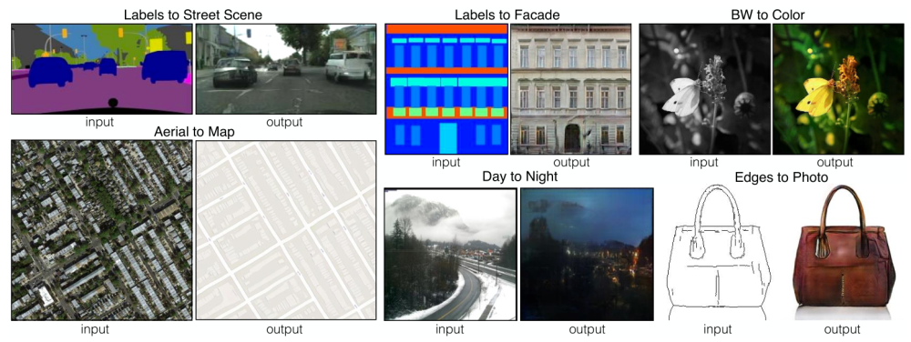
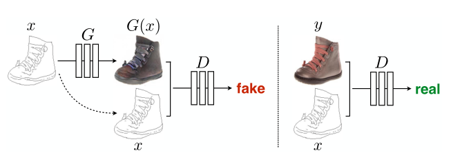
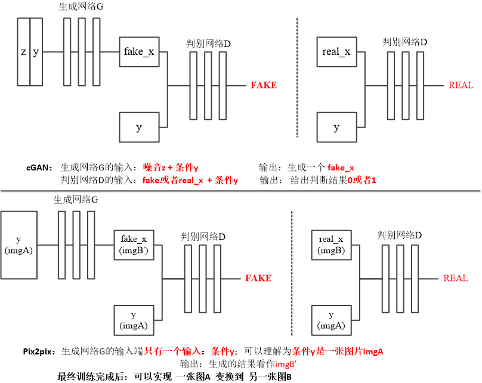
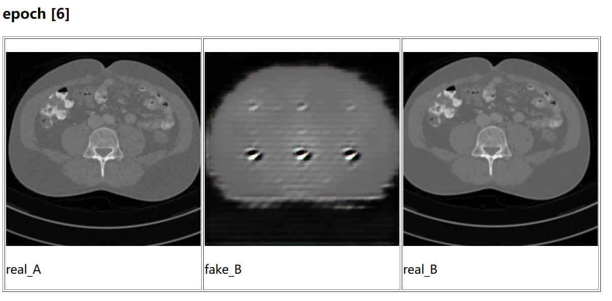
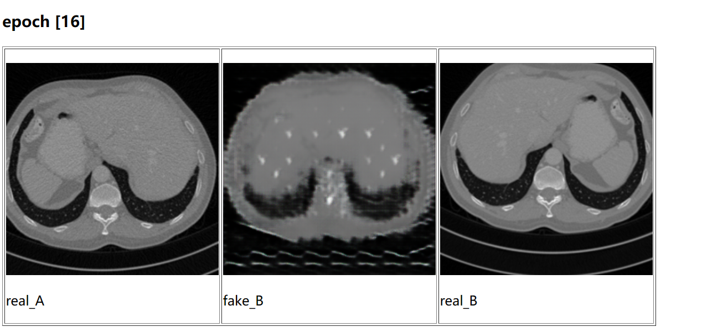
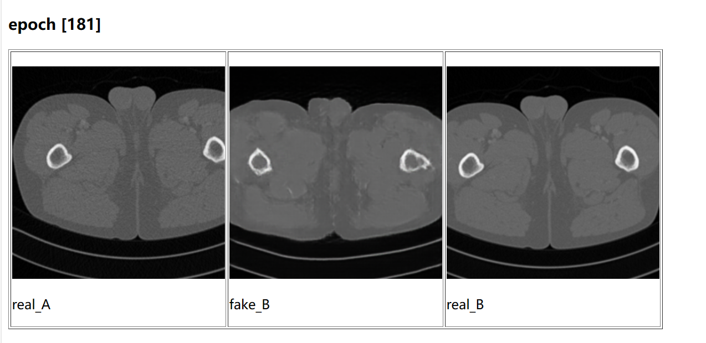
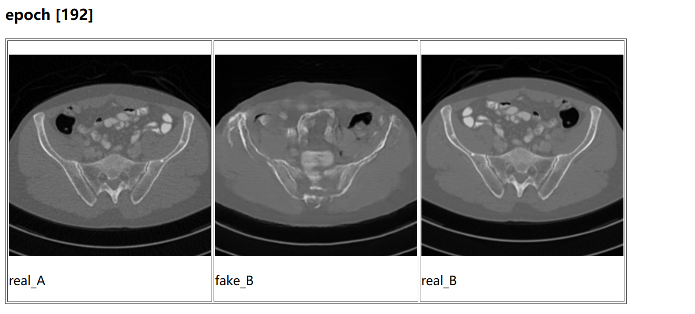
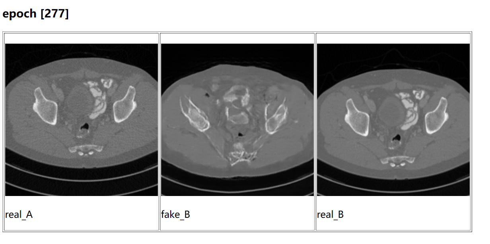
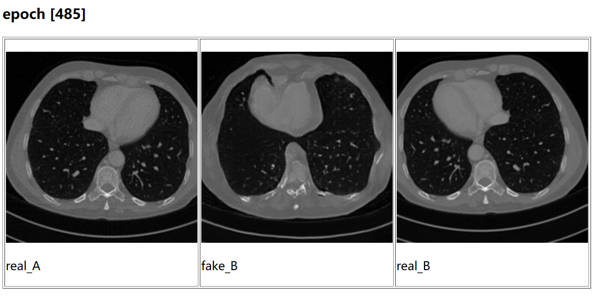
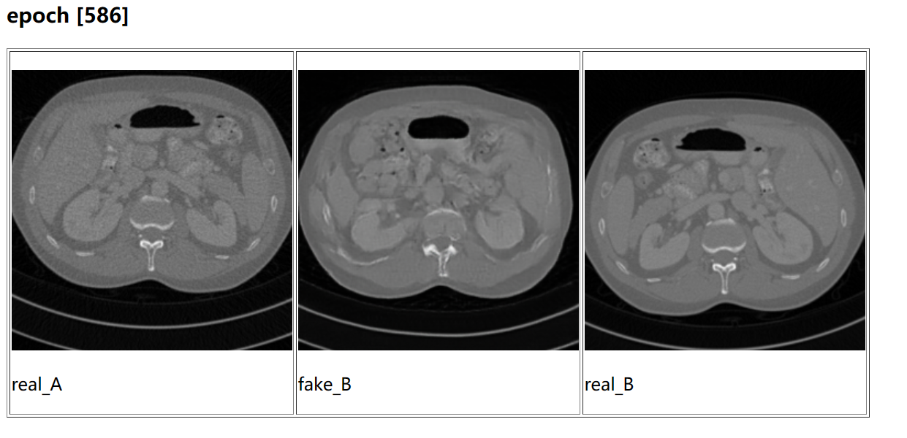

# pix2pix
Pytorch实现版本

## 模型介绍

图像处理、计算机图形学和计算机视觉中的许多问题都可以被视为将**输入图像“翻译”成相应的输出图像**。 “翻译”常用于语言之间的翻译，比如中文和英文的之间的翻译。但图像翻译的意思是**图像与图像之间以不同形式的转换**。比如：一个图像场景可以以RGB图像、梯度场、边缘映射、语义标签映射等形式呈现，其效果如上图。

## 核心思想

### **图像建模的结构化损失**

​		图像到图像的翻译问题通常是根据像素分类或回归来解决的。这些公式将输出空间视为**“非结构化”**，即在给定输入图像的情况下，每个输出像素被视为与所有其他像素有条件地独立。

​		而cGANs（ conditional-GAN）的不同之处在于学习**结构化损失**，并且理论上可以惩罚输出和目标之间的任何可能结构。

在此之前，许多研究者使用 GAN 在修复、未来状态预测、用户约束引导的图像处理、风格迁移和超分辨率方面取得了令人瞩目的成果，但每种方法都是针对特定应用而定制的。Pix2pix框架不同之处在于没有特定应用。它在生成器和判别器的几种架构选择中也与先前的工作不同。

​		对于**生成器，我们使用基于“U-Net”的架构**；对于**鉴别器，我们使用卷积“PatchGAN”分类器**，其仅在image patches（图片小块）的尺度上惩罚结构。

​		Pix2pix 是借鉴了 cGAN 的思想。cGAN 在输入 G 网络的时候不光会输入噪音，还会输入一个条件（condition），G 网络生成的 fake images 会受到具体的 condition 的影响。那么如果把一副图像作为 condition，则生成的 fake images 就与这个 condition images 有对应关系，从而实现了一个 Image-to-Image Translation 的过程。Pixpix 原理图如下：

### 对比CGAN和p2p

### loss函数

一般的 cGANs 的目标函数如下：
$$
L_{cGAN}(G, D) =E_{x,y}[log D(x, y)]+E_{x,z}[log(1 − D(x, G(x, z))]
$$
先看判别器，当给判别器真图的时候，判别器认为真图是真图的概率要足够的大，也就是式子的第一项要足够的大；如果是假图的话，判别器认为假图是真图的概率应该要足够的小，即第二项要尽可能的小。所以判别器的优化目标是最大化第一项和第二项，也就是**最大化整个函数**。

而**生成器**其实就是使得第二项尽可能的大，即让判别器以为假图是真图的概率越大越好：生成器无法控制第一项，因为第一项是判别器认为真图是真图的概率，这对于生成器来说只能算得上是一个常数。所以**生成器的目标就是要努力使得这个函数最小化**。

为了实现条件化，需要添加一个L1损失项目,因此最终的loss为G*
$$
G^{*} = \arg\min_{G}\max_{D}\mathcal{L}_{cGAN}\left(G, D\right) + \lambda\mathcal{L}_{L1}\left(G\right)
$$

代码效果展示

